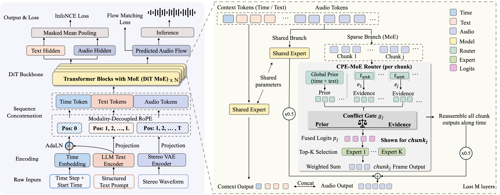

# SonicWeave

**Chunk-Routed Mixture-of-Experts for Unified Audio Scene Generation**

[Project Page](https://caiyunrui.github.io/SonicWeave/)
&nbsp;|&nbsp;
[arXiv](ARXIV_LINK)

SonicWeave is a unified flow-matching model for generating speech, singing,
music, sound effects, and their fine-grained mixtures with a single set of
parameters.

At its core, SonicWeave introduces **CPE-MoE
(Conflict-Gated Prior–Evidence Mixture-of-Experts)**. CPE-MoE routes
temporally contiguous acoustic chunks by combining:

- a global prior derived from the structured text condition and diffusion phase;
- local evidence from the evolving acoustic representation;
- a learned conflict gate that dynamically balances the two routing signals.

This design enables fine-grained conditional computation across heterogeneous
audio domains and within locally distinct regions of the same complex scene.

## Model Overview

  

SonicWeave jointly models structured text and continuous audio latents in a
flow-matching diffusion transformer. Text and time tokens remain on a stable
shared pathway, while CPE-MoE routes contiguous audio chunks through sparse
experts. Chunking controls expert selection only: the selected experts still
transform the original frame-level representations.

## Audio Demo

Audio samples covering text-to-speech, text-to-audio, text-to-music, singing,
complex audio scenes, and controlled model comparisons are available on the
[project page](https://caiyunrui.github.io/SonicWeave/).

## Citation

Citation information will be added after the arXiv release.
